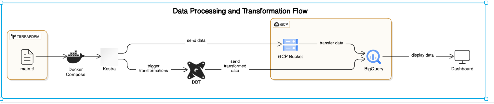
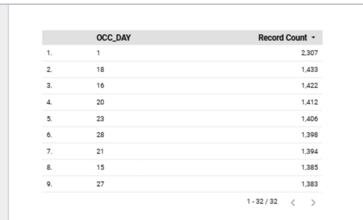
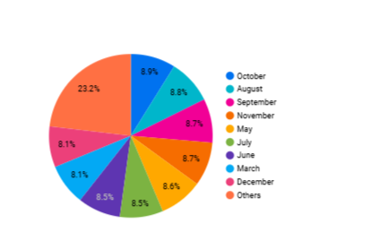
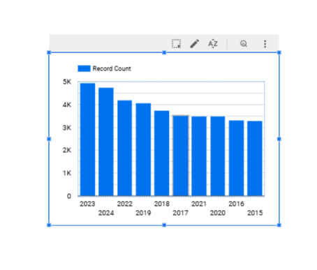
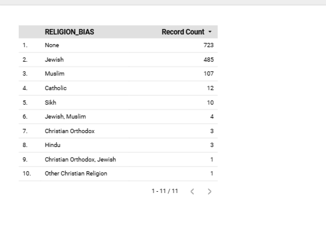

# Project: End-to-End Data Pipeline for Crime Data Analysis

## Objective
The goal of this project is to apply everything we have learned in this course to build an end-to-end data pipeline to analyze crime trends. This pipeline will process and transform crime-related datasets, providing insights into the causes of crime and patterns based on time.

## Problem Statement
The project focuses on the increase in Auto theft and other crimes in Toronto. The goal is to create a cloud-based pipeline that analyzes the factors contributing to this increase. The questions we aim to answer include:
- What is the cause of the increase in crimes?
- What day, month, and year have the highest number of crimes?

## Datasets Used

### 1. **Major Crime Indicators**
This dataset includes all Major Crime Indicators (MCI) occurrences by reported date. The dataset categorizes crimes into various types, including:
- Assault
- Break and Enter
- Auto Theft
- Robbery
- Theft Over (Excludes Sexual Assaults)

The data is provided at the offence and/or victim level, so one occurrence may have several rows of data associated with the various MCIs used to categorize the crime.

### 2. **Hate Crimes Open Data**
This dataset includes all verified Hate Crime occurrences investigated by the Hate Crime Unit since 2018. The data categorizes Hate Crimes based on the following bias categories:
- Age
- Mental or Physical Disability
- Race
- Ethnicity
- Language
- Religion
- Sexual Orientation
- Gender
- Other Similar Factors

Each occurrence may be associated with multiple bias categories, allowing a deeper understanding of the various factors contributing to hate crimes.

### **Definitions**
- **Hate Crime**: A criminal offence motivated by bias, prejudice, or hate based on factors like race, religion, age, disability, sexual orientation, or gender.
- **Hate Incident**: A non-criminal behavior motivated by hate, such as racial slurs or insults based on someone’s ethnic or religious identity.

## Problem
Toronto has seen a steady increase in Auto theft and other crimes. This project aims to build a data pipeline to analyze the reasons behind this increase in crime rates. The analysis will help identify the most crime-prone days, months, and years, as well as contributing factors to the rise in crime.

The data is available at: [Toronto Open Data Portal](https://open.toronto.ca/)

## Data Pipeline Overview
This project uses a **batch processing pipeline** to process crime data and store it in a data warehouse (BigQuery), where it is then transformed and analyzed.




## Technologies Used
- **Cloud**: Google Cloud Platform (GCP)
- **Infrastructure as Code (IaC)**: Terraform
- **Workflow Orchestration**: Kestra
- **Data Transformation**: DBT (Data Build Tool)
- **Data Warehouse**: BigQuery

## Setup and Configuration

### 1. **Terraform Script Execution**
   - This project uses a main Terraform script to deploy Docker Compose with Kestra and the necessary cloud infrastructure on GCP.
   - Execute the Terraform script to provision resources and deploy the infrastructure.
   - Example command:
     ```bash
     terraform init
     terraform apply
     ```

### 2. **Docker Compose with Kestra**
   - The main script will deploy Docker Compose to set up Kestra for workflow orchestration. The Docker Compose setup will automatically deploy the necessary Kestra services.

### 3. **Lance Tasks**
After executing the main Terraform script, the following tasks are executed to set up the GCP infrastructure and deploy the required services:

1. **01_gcp_kv**: Create and configure GCP Key Vault to securely store and manage secrets, such as API keys and credentials.
2. **02_gcp_setup**: Set up basic GCP services, including authentication and cloud resource configuration.
3. **03_gcp_bucket**: Create Google Cloud Storage buckets for storing raw and processed data.
4. **04_gcp_bigQuery**: Create BigQuery datasets and tables to store the transformed crime data.
5. **05_gcp_dbt**: Set up DBT configurations to connect to BigQuery and perform the necessary data transformations.

### 4. **Creating the Dashboard**
   - After the data is processed and loaded into BigQuery, a dashboard is created using Google Data Studio (or any other visualization tool) to display key insights into crime trends.
   - The dashboard will include visualizations that answer questions like:
     - What day, month, and year have the highest crime rates?
     - Which crime types are increasing the most?




## How Does It Work?

1. **Data Ingestion**:
   - The project starts by ingesting the crime data from the Toronto Open Data Portal.
   - The data is stored in the data lake on Google Cloud Storage or other cloud storage services.

2. **Orchestration**:
   - Kestra orchestrates the pipeline by scheduling and managing tasks like data extraction, transformation, and loading into BigQuery.
   - The tasks include:
     - Extracting the data.
     - Transforming it using DBT to clean, aggregate, and format it.
     - Loading it into BigQuery for analysis.

3. **Data Transformation**:
   - DBT transforms the raw data into structured datasets, applying necessary calculations and aggregations.
   - The data is organized for easier analysis, focusing on crime types, dates, and bias categories.

4. **Data Storage**:
   - The final transformed data is stored in BigQuery, a cloud-based data warehouse, where it is optimized for queries and analysis.

5. **Data Visualization**:
   - Once the data is transformed, a dashboard is built to visualize crime trends, focusing on patterns such as:
     - Which day, month, and year have the highest crime rates?
     - Understanding the rise in crime types, especially Auto Theft.

## Requirements

To run this project, you'll need the following tools and services:

### 1. **Google Cloud Platform (GCP) Account**
   - You'll need a GCP account to set up BigQuery, Cloud Storage, and other required cloud resources.

### 2. **Terraform**
   - Install Terraform to manage infrastructure as code (IaC) for provisioning GCP resources.
   - Terraform CLI (minimum version 0.14)

### 3. **Docker and Docker Compose**
   - Install Docker and Docker Compose to run the Kestra orchestrator.

### 4. **Kestra**
   - Install Kestra for managing and orchestrating the data pipeline tasks.

### 5. **DBT (Data Build Tool)**
   - Install DBT to perform the data transformation inside BigQuery.

### 6. **BigQuery**
   - Set up BigQuery to store and query the data once it is processed.
   
### 7. **Dashboarding Tool**
   - Optional: Tools like Google Data Studio or Looker for visualizing the data and creating dashboards.

### 8. **Other Dependencies**
   - Python (for custom scripts, if necessary)
   - Google Cloud SDK for authentication and management

## Running the Project
1. Execute the Terraform script to deploy the necessary cloud resources and infrastructure.
2. Deploy Kestra using Docker Compose to orchestrate the pipeline tasks.
3. Use Kestra to trigger the pipeline and load data from the lake to the warehouse.
4. Use DBT to transform and clean the data in BigQuery.
5. Access the dashboard to visualize crime trends and patterns based on time.

## Conclusion
This project demonstrates how to create a scalable cloud-based data pipeline to process and analyze crime-related data. By building a pipeline using Terraform, Kestra, DBT, and BigQuery, we gain valuable insights into the patterns and causes of crime, contributing to better decision-making and understanding of crime trends in Toronto.


